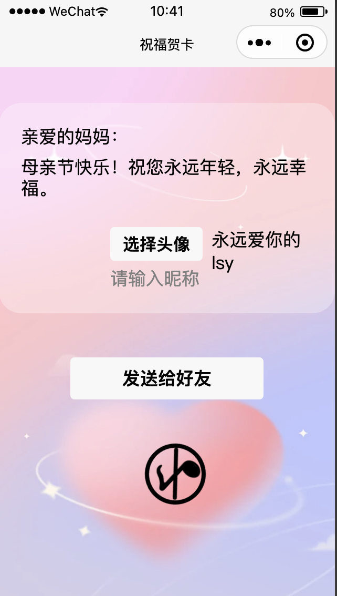
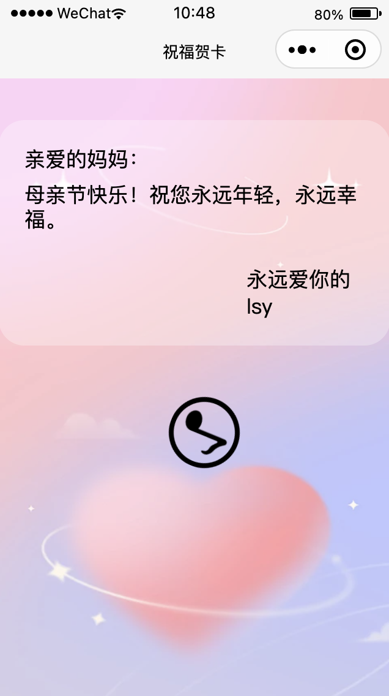
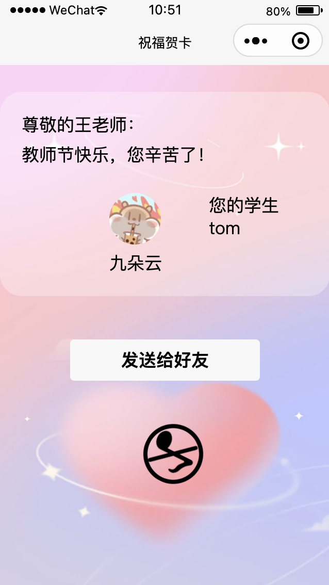
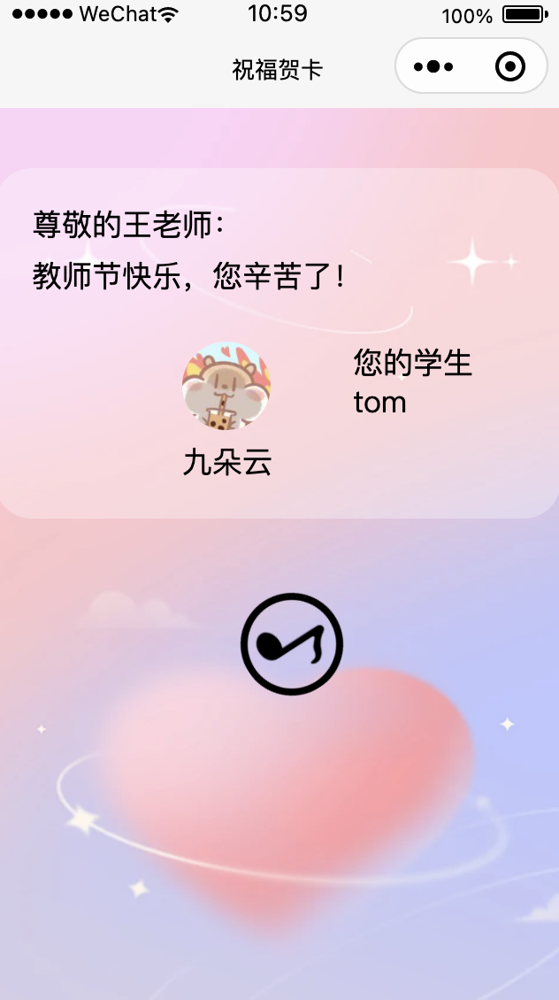

# 项目介绍
本项目是用微信开发者工具开发的贺卡小程序
# 项目功能
- 支持修改默认贺卡内容进行自定义，并能同步到发送详情页
实现步骤：自定义文字部分使用input和textarea，绑定bindinput实现数据实时更新。通过在onShareMessage中路由传递参数然后在onLoad中options获取来更新发送详情页的数据。
- 选择头像和昵称，包含微信发送人信息
实现步骤：在onLoad通过云函数helloCloud获取用户openid，头像通过bindchooseavatar事件获取图片并以openid为唯一标识上传到云开发存储空间，昵称通过type="nickname"的input获取，并在blur中存储。
- 贺卡内容发送给好友后不可更改。另外，若没有选择头像，则发送详情页选择头像按钮隐藏。同样如果没有输入昵称或者选择微信默认昵称，则发送详情页的昵称input隐藏。
实现步骤：通过isMe辨别是编辑页还是详情页，头像部分如果成功获取改变flagA，编辑页和有头像的详情页显示组件，昵称同理。
- 进入贺卡小程序自动播放音乐，音乐按钮无限旋转。点击音乐按钮后按钮停止旋转，音乐暂停。
实现步骤：在onLoad中初始化背景音乐组件，toggleMusic控制音乐的播放和暂停对应逻辑
# 效果图展示
- 默认文字，未选择头像昵称：
发送页

分享页

- 修改文字和头像昵称：
发送页

分享页

# 项目配置
- 基础库版本为3.3.4
- 修改appid
- 项目需要配置云开发支持头像功能，同时cloudfunctions包含了云函数helloCloud，需要上传到自己的云函数进行使用，否则可能出现无法正常显示头像的情况

# 注意事项
- 音乐的播放暂停图片已上传到本人云存储
- 按钮的分享功能可能会失效，可以右上角分享

